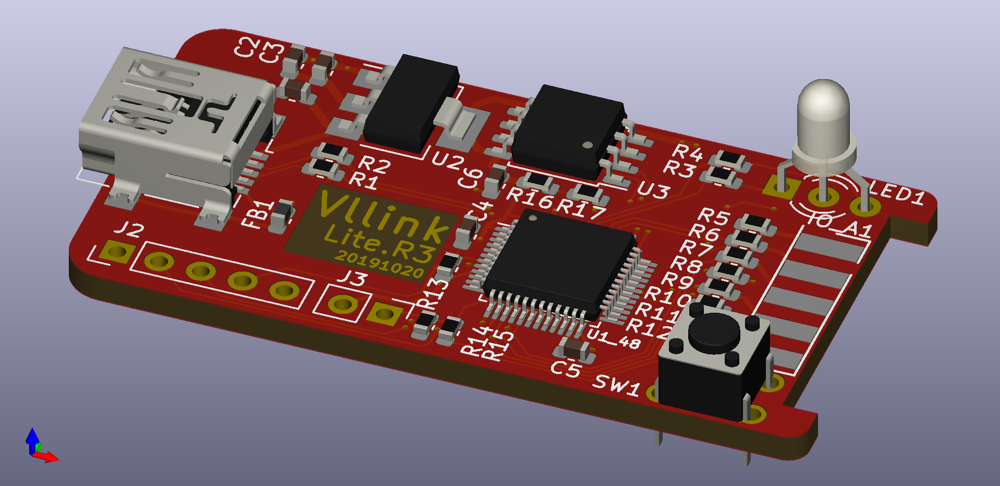

# TODO List
## 近期目标
1. 编写通过WebUSB对Vllink Lite进行固件更新的网页
2. 编写 ID_DAP_Vendor1 - ID_DAP_Vendor5 串口命令，支持多路串口同时收发
## 远期目标
1. 利用板上SPI Flash，研究自动化较高的离线编程器方案
2. 解决Bootloader中必须包含CMSIS-DAP v2接口才能被Win10免驱识别的问题，并完成控制端点接口
3. SWO功能测试
-----------------------------------

# Vllink Lite
## 简介
Vllink Lite是一款低成本高性能调试器。硬件基于GD32F350制作，最小封装为QFN28，标准版本使用GD32F350G8U6（8K RAM / 64K ROM），亦可在精简缓冲后换用GD32F350G6U6（6K RAM / 32K ROM）。

## 硬件
当前最新版本为：[Vllink Lite.R3](https://github.com/vllogic/vllink_lite/tree/000b3bc6477d7fd816e0debf9087d155adbe143d/hardware/vllink_lite.r3)，板上SPI Flash可选。

## 功能
* 支持固件更新，按住按键连接Win10电脑，再使用Chrome浏览器打开更新页面即可（网页制作中...）
* 提供一路CMSIS-DAP V2协议免驱接口，提供SWD及JTAG接口，已支持IAR for ARM（版本8.32.1及以上）、MDK-ARM（版本5.29）、[PyOCD](https://github.com/vllogic/pyOCD)
* 提供一路USB CDC接口

## 特点
* 低成本，软硬件全部开源
* 优化了底层传输协议，尽量使用SPI通讯，主流IDE默认速率下对SRAM的读写速度可达240KB/S(SWD)或200KB/S(JTAG)，相比DAPLink，大约提升一倍。如果使用优化版的OpenOCD，读写速度可达400KB/s以上。

## 硬件制作
[原理图及PCBA制作资料](https://github.com/vllogic/vllink_lite/tree/master/hardware)

[固件](https://github.com/vllogic/vllink_lite/releases)

## 开发平台
* KiCAD
* IAR for ARM 8.32.3
* GD32F3x0 AddOn [获取地址](http://gd32mcu.21ic.com/documents)

## 授权
GPLv3，随便玩

## 交流
欢迎加入QQ群：512256420
